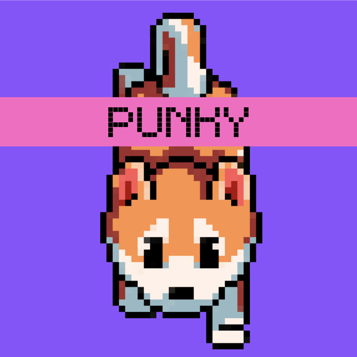

# Punky TG MiniApp (Alpha Test Version)

Try out the demo version of our product on TG bot **[@PunkyAIBot](https://t.me/punkyaibot)**

## Gameplay

**Punky Shiba Inu**, our MVP, is a GameFi + AI Companion Telegram Minigame which deploys on **Solana**. Within this game, users can build healthy relationships with both their personalized AI virtual pets and other players.

1. **Nurturing AI companions through consistent emotional bonding**

Masters can pour out their emotions to Punky, and Punky will reply and comfort its master. At the same time, Punky will also actively interact with the user, so that the user can experience the two-way giving of feelings and establish a deeper emotional bond. As Punky builds deeper emotional bond with its master, Punky will gain feature weighting and change its appearance. Users can use their own Punky features to build their unique Punky, a one-of-a-kind digital collector's item engraved with full emotional value.

2. **Gaining Identity and Belonging within Punky Community**

By holding Punky and continuing bonding with it, Punky HOLDER naturally fits into the punky community, a family filled with caring and love. Punky serves as the bridge between users, enabling diverse and interesting Punky players to connect with each other and find companionship through social gameing, such as e-dog-walking. Holding a personalized and rare Punky NFT essentially gives HOlDER a sense of identity and belongingness within the Punky family.

3. **Trading dynamic Punky AI NFT in the marketplace freely**

Punky HOLDERs can trade Punky freely on the marketplace, in part or in whole. Users can choose to trade only Punky's certain traits or the entire Punky. Meanwhile, users can inscribe their memories with Punky on-chain, which provides an option for users to keep their Punky personalised while being traded for potential gains.

## Where to find us

- **Our Telegram Bot**: [@PunkyAIBot](https://t.me/punkyaibot)
- **Our Website**: [https://punky.app/](https://punky.app/)
- **Follow us on Twitter/X**: [@punkycompanion](https://x.com/punkycompanion)
- **Join our community on Telegram**: [t.me/punkyaipunky](t.me/punkyaipunky)
